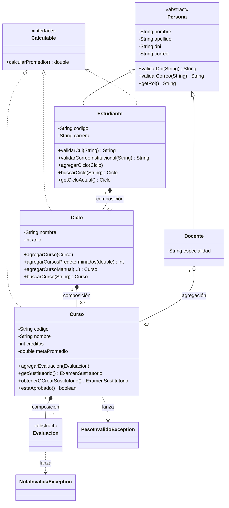

# UML del dominio (Estudiante 1)

```mermaid
classDiagram
    class Calculable {
        <<interface>>
        +calcularPromedio() double
    }
    class Persona {
        <<abstract>>
        -String nombre
        -String apellido
        -String dni
        -String correo
        +validarDni(String) String
        +validarCorreo(String) String
        +getRol() String
    }
    class Estudiante {
        -String codigo
        -String carrera
        +validarCui(String) String
        +validarCorreoInstitucional(String) String
        +agregarCiclo(Ciclo)
        +buscarCiclo(String) Ciclo
        +getCicloActual() Ciclo
    }
    class Docente {
        -String especialidad
    }
    class Ciclo {
        -String nombre
        -int anio
        +agregarCurso(Curso)
        +agregarCursosPredeterminados(double) int
        +agregarCursoManual(...) Curso
        +buscarCurso(String) Curso
    }
    class Curso {
        -String codigo
        -String nombre
        -int creditos
        -double metaPromedio
        +agregarEvaluacion(Evaluacion)
        +getSustitutorio() ExamenSustitutorio
        +obtenerOCrearSustitutorio() ExamenSustitutorio
        +estaAprobado() boolean
    }
    class Evaluacion {
        <<abstract>>
    }
    class NotaInvalidaException
    class PesoInvalidoException

    Persona <|-- Estudiante
    Persona <|-- Docente
    Calculable <|.. Estudiante
    Calculable <|.. Ciclo
    Calculable <|.. Curso
    Estudiante "1" *-- "0..*" Ciclo : composición
    Ciclo "1" *-- "0..*" Curso : composición
    Curso "1" *-- "6..7" Evaluacion : composición
    Docente "1" o-- "0..*" Curso : agregación
    Curso ..> PesoInvalidoException : lanza
    Evaluacion ..> NotaInvalidaException : lanza
```