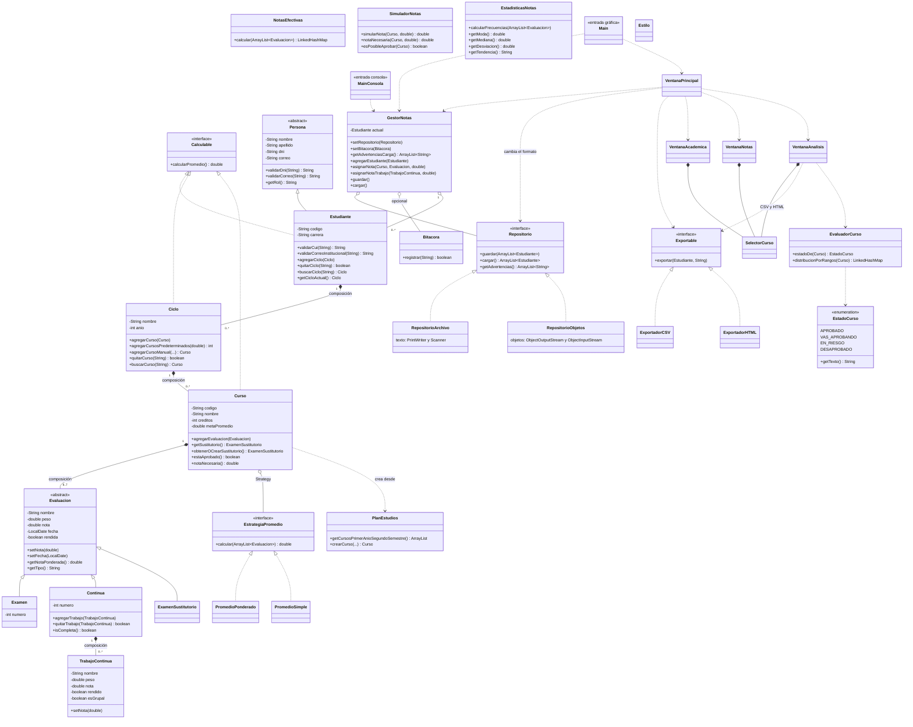

# Diagrama de Clases UML — Sistema de Notas UNSA

```mermaid
classDiagram
    %% Paquete modelo
    class Calculable {
        <<interface>>
        +calcularPromedio() double
    }
    class Persona {
        <<abstract>>
        -String nombre
        -String apellido
        -String dni
        -String correo
        +validarDni(String) String
        +validarCorreo(String) String
        +getRol() String
    }
    class Estudiante {
        -String codigo
        -String carrera
        +validarCui(String) String
        +validarCorreoInstitucional(String) String
        +agregarCiclo(Ciclo)
        +quitarCiclo(String) boolean
        +buscarCiclo(String) Ciclo
        +getCicloActual() Ciclo
    }
    class Ciclo {
        -String nombre
        -int anio
        +agregarCurso(Curso)
        +agregarCursosPredeterminados(double) int
        +agregarCursoManual(...) Curso
        +quitarCurso(String) boolean
        +buscarCurso(String) Curso
    }
    class Curso {
        -String codigo
        -String nombre
        -int creditos
        -double metaPromedio
        +agregarEvaluacion(Evaluacion)
        +getSustitutorio() ExamenSustitutorio
        +obtenerOCrearSustitutorio() ExamenSustitutorio
        +estaAprobado() boolean
        +notaNecesaria() double
    }

    %% Paquete evaluaciones
    class Evaluacion {
        <<abstract>>
        -String nombre
        -double peso
        -double nota
        -LocalDate fecha
        -boolean rendida
        +setNota(double)
        +setFecha(LocalDate)
        +getNotaPonderada() double
        +getTipo() String
    }
    class Examen {
        -int numero
    }
    class Continua {
        -int numero
        +agregarTrabajo(TrabajoContinua)
        +quitarTrabajo(TrabajoContinua) boolean
        +isCompleta() boolean
    }
    class TrabajoContinua {
        -String nombre
        -double peso
        -double nota
        -boolean rendido
        -boolean esGrupal
        +setNota(double)
    }
    class ExamenSustitutorio

    %% Paquete calculos y plan
    class EstrategiaPromedio {
        <<interface>>
        +calcular(ArrayList~Evaluacion~) double
    }
    class PromedioPonderado
    class PromedioSimple
    class NotasEfectivas {
        +calcular(ArrayList~Evaluacion~) LinkedHashMap
    }
    class SimuladorNotas {
        +simularNota(Curso, double) double
        +notaNecesaria(Curso, double) double
        +esPosibleAprobar(Curso) boolean
    }
    class EstadisticasNotas {
        +calcularFrecuencias(ArrayList~Evaluacion~)
        +getModa() double
        +getMediana() double
        +getDesviacion() double
        +getTendencia() String
    }
    class EvaluadorCurso {
        +estadoDe(Curso) EstadoCurso
        +distribucionPorRangos(Curso) LinkedHashMap
    }
    class EstadoCurso {
        <<enumeration>>
        APROBADO
        VAS_APROBANDO
        EN_RIESGO
        DESAPROBADO
        +getTexto() String
    }
    class PlanEstudios {
        +getCursosPrimerAnioSegundoSemestre() ArrayList
        +crearCurso(...) Curso
    }

    %% Paquete persistencia, exportacion, app y gui
    class Repositorio {
        <<interface>>
        +guardar(ArrayList~Estudiante~)
        +cargar() ArrayList~Estudiante~
        +getAdvertencias() ArrayList~String~
    }
    class RepositorioArchivo {
        texto: PrintWriter y Scanner
    }
    class RepositorioObjetos {
        objetos: ObjectOutputStream y ObjectInputStream
    }
    class Bitacora {
        +registrar(String) boolean
    }
    class Exportable {
        <<interface>>
        +exportar(Estudiante, String)
    }
    class ExportadorCSV
    class ExportadorHTML
    class GestorNotas {
        -Estudiante actual
        +setRepositorio(Repositorio)
        +setBitacora(Bitacora)
        +getAdvertenciasCarga() ArrayList~String~
        +agregarEstudiante(Estudiante)
        +asignarNota(Curso, Evaluacion, double)
        +asignarNotaTrabajo(TrabajoContinua, double)
        +guardar()
        +cargar()
    }
    class Main {
        <<entrada gráfica>>
    }
    class MainConsola {
        <<entrada consola>>
    }
    class VentanaPrincipal
    class VentanaAcademica
    class VentanaNotas
    class VentanaAnalisis
    class SelectorCurso
    class Estilo

    %% Relaciones
    Persona <|-- Estudiante
    Calculable <|.. Estudiante
    Calculable <|.. Ciclo
    Calculable <|.. Curso
    Estudiante "1" *-- "0..*" Ciclo : composición
    Ciclo "1" *-- "0..*" Curso : composición
    Curso "1" *-- "6..7" Evaluacion : composición

    Evaluacion <|-- Examen
    Evaluacion <|-- Continua
    Evaluacion <|-- ExamenSustitutorio
    Continua "1" *-- "0..*" TrabajoContinua : composición

    EstrategiaPromedio <|.. PromedioPonderado
    EstrategiaPromedio <|.. PromedioSimple
    Curso o-- EstrategiaPromedio : Strategy
    Curso ..> PlanEstudios : crea desde

    Repositorio <|.. RepositorioArchivo
    Repositorio <|.. RepositorioObjetos
    Exportable <|.. ExportadorCSV
    Exportable <|.. ExportadorHTML
    GestorNotas o-- Repositorio
    GestorNotas o-- Bitacora : opcional
    GestorNotas "1" o-- "0..*" Estudiante

    Main ..> GestorNotas
    Main ..> VentanaPrincipal
    MainConsola ..> GestorNotas
    VentanaPrincipal ..> GestorNotas
    VentanaPrincipal ..> Repositorio : cambia el formato
    VentanaPrincipal ..> Exportable
    VentanaPrincipal ..> VentanaAcademica
    VentanaPrincipal ..> VentanaNotas
    VentanaPrincipal ..> VentanaAnalisis
    VentanaAcademica *-- SelectorCurso
    VentanaNotas *-- SelectorCurso
    VentanaAnalisis *-- SelectorCurso
    VentanaAnalisis ..> Exportable : CSV y HTML
    VentanaAnalisis ..> EvaluadorCurso
    EvaluadorCurso ..> EstadoCurso
```
